<style>
.list-group-item.active, .list-group-item.active:focus, .list-group-item.active:hover {
    background-color: #EA5933;
}
</style>

<style>
.nav>li>a {
    position: relative;
    display: block;
    padding: 10px 15px;
    color: #EA5933;
    font-weight: bold;
}
.nav-pills>li.active>a, .nav-pills>li.active>a:hover, .nav-pills>li.active>a:focus {
    color: white;
    background-color: #EA5933;
}
</style>


<script> 
    $(document).ready(function() { 
    $head = $('#header'); 
    $head.prepend('<A href = https://www.cuttingedge-events.com></A>') 
    }); 
</script> 


```{r echo=FALSE, message=FALSE,warning=FALSE}
library(readxl)
library(dplyr)
library(knitr)
```

# SUGGESTED ACTIVITIES {.tabset .tabset-fade .tabset-pills}

## Jeep Safari

A non-competitive enjoyable off-road adventure full of fun that winds through back roads and lets participants enjoy some great sights. We'll visit typical Andalusian white-washed towns as well as local lakes and rivers depending on the tide and weather. Participants will also have the chance to take a break and a quick dip in a stream depending on the route you choose. 

Lunch stop at a local mountain restaurant can be organised (not included) followed by the return trip back to the hotel or departure point through one of the Costa del Sol's most beautiful areas. Several routes to choose from. 

Each car is 8 seaters, so 8 people will be in one Jeep. 

* **Required**: No special clothes required.

* **Duration**: from 3h to 8h depending on the route.

* **Max. participants**: 100 pax

* **Min. participants**: 15 pax 

<br>

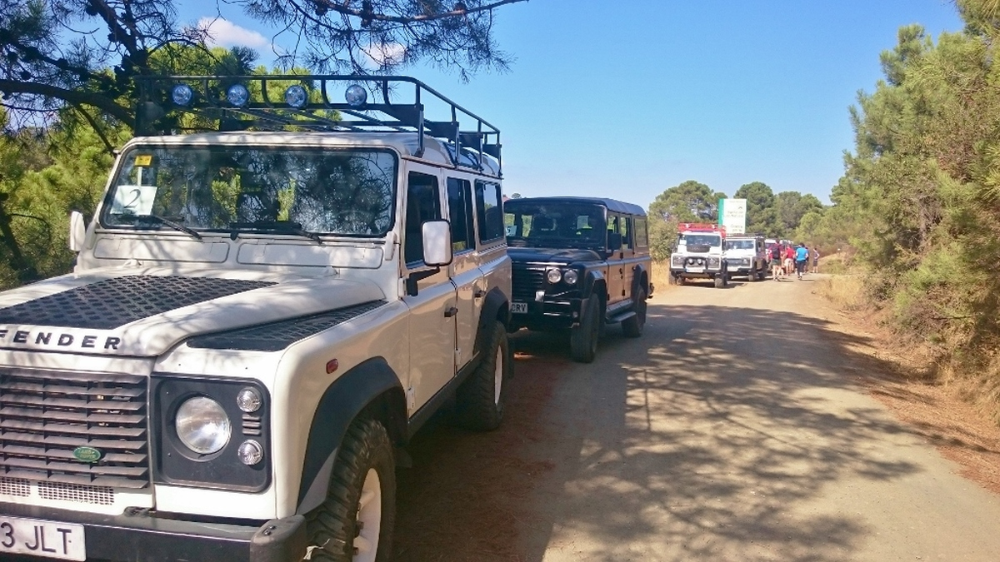

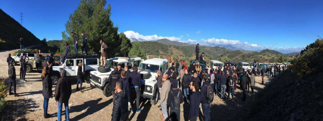

## Paella contest

The Paella challenge begins with an informative session and enda with a highly entertaining and competitive Paella contest. Participants will be split up into teams that will be represented by different group members. They will create their own brand and logo and set their tables for the final presentation which must include a song about their great new Paella. 

Lastly, the team with the best tasting Paella will be announced. Prized will be awarded in teh different categories: *the winner of the Paella trivia contest*,  *the team with the best marketing campaign* and *the team with teh best tasting Paella*. The Paella contest is a fun event that encourages creativity, cooperation, team building and bonding in order to come up with the best product and the most creative marketing campaign. 

* **Location**: location is not included. An outdoor space must be rent.

* **Required**: No special clothes required.

* **Duration**: 2h - 3h.

* **Max. participants**: 100 pax

* **Min. participants**: 20 pax 

<br>

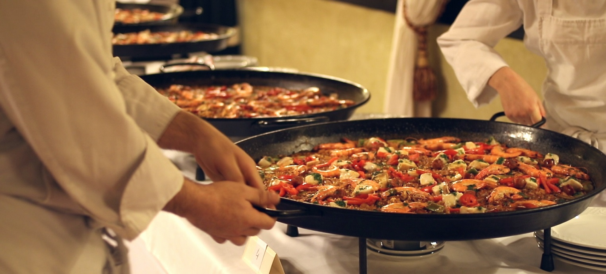

## Canyonig

An unforgettable activity suitable for every level of experience. This activity includes a canyon descent through a waterfall, natural waterslides and some wading and swimming. Wetsuits might be necessary. Life vests, ropes and helmets are proveided. 

* **Difficulty**: Medium level

* **Required**: Sports shoes and swimming suite.

* **Duration**: From 2 hours to 3 hours.

* **Max. participants**: 40 pax

* **Min. participants**: 6 pax 

<br>

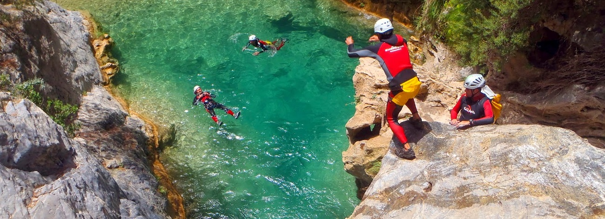

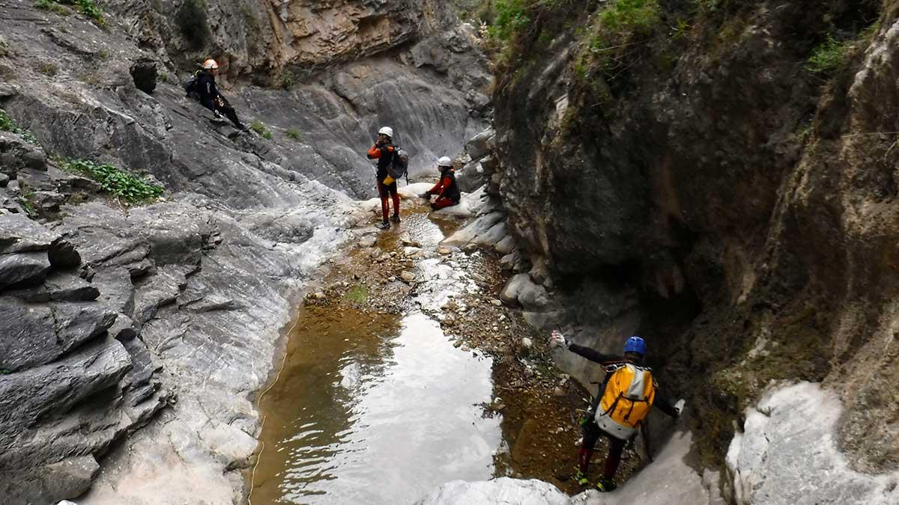

## Hiking

Go and hike along Malaga! A half-day walking tour through the great outdoors. You'll experience local flora & wildlife, tread through olive orchards and take in lots of fresh air, the smell of nature and some amazing sights. Our local guides will share their knowledge of the region's history and landscape with you. 

There are 3 different levels. Beginner level, Medium level and Advanced level. 

* **Difficulty**: Beginners/ Medium level / Advanced level

* **Required**: Comfortable shoes or hiking boots and comfortable clothes.

* **Duration**: From 2 hours to 4 hours.

* **Max. participants**: 100 pax

* **Min. participants**: 6 pax 

<br>

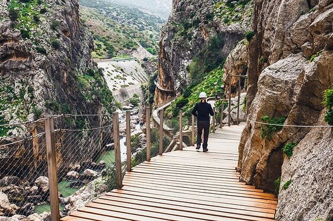

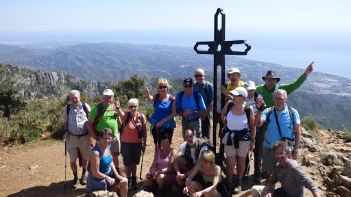


## Robinson Crusoe - Basecamp

Participating teams will battle it out with each other and receve a special supply kit containing all the necessary materials in order to construct their base camp and to complete different feats such as, constructing a shelter and building a raft. In order to receive key missing supplies, however teams must succesfuly complete certain tasks. 

Team members will later have to succesfully race their rafts on the water hoping to stay afloat. There are no rules and anything goes so be on the lookout and be careful! Although physical contact is not allowed, stealing of items and ideas is! Planning, organization and teamwork are essential.

* **Location**: Beach (a permit must be required)

* **Required**: Swimming suit, comfortable clothes.

* **Duration**: From 2h to 3h

* **Max. participants**: 400 pax

* **Min. participants**: 30 pax 

<br>

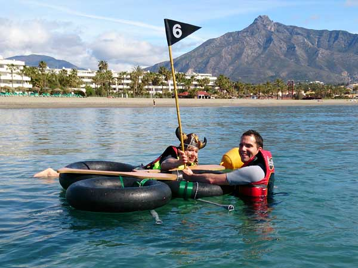

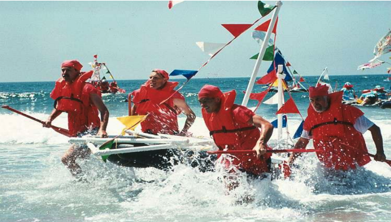

## Caving

Caving or speology is the exploration of natural undergroud passages and chambers, usually formed where water has dissolved away limestone, or other smiilary soft rock. It is an adventure sport with little risks. With good guidance, training and the correct equipment. This sport, cavins is often considered a combination of climbing/ abseiling, hiking/ fell running and, on occasion, swimming. An unforgetabble activity suitable for every level of experience.

This activity takes place in Ronda, a small village located 50 minutes from Marbella. 

* **Difficulty**: Beginners level.

* **Required**: Sports shoes, swimming suite and comfortable clothes.

* **Duration**: From 2h to 3h.

* **Max. participants**: 20 pax

* **Min. participants**: 6 pax

<br>

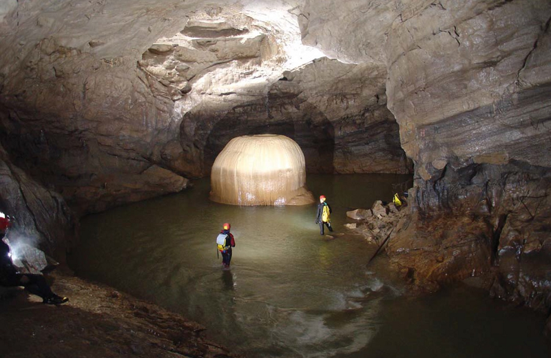

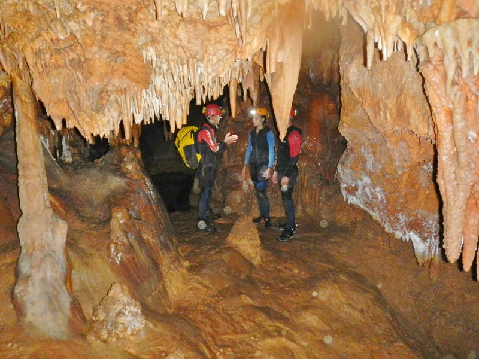

## Quad experience

Enjoy the adventure of a Quad ride by climbing to the top of the mountain peaks and exploring hidden valleys through trails that are off the beaten path. Quad biking is definitely one of the most exciting activities on four wheels. Our routes in the countryside around Marbella allow you to enjoy the feeling of speed, or just take it easy and cruise through some of the most beautiful scenery in Marbella Mountains.

* **Difficulty**: Beginners level.

* **Required**: Sports shoes and comfortable clothes.

* **Duration**: From 1h30 to 3h

* **Max. participants**: 16 pax

* **Min. participants**: 4 pax.

<br>

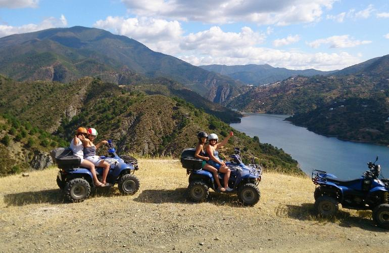

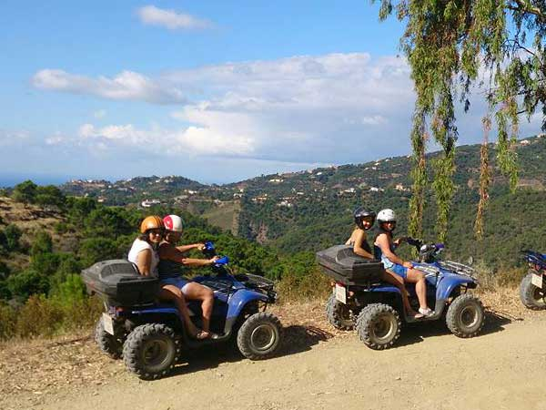

# SUGGESTED VENUES {.tabset .tabset-fade .tabset-pills}

## Trocadero Arena

<iframe src="restaurants/trocadero/trocadero.html" frameborder="0" width="100%" height="1000" scrolling="no"></iframe>

**Availability for October the 4th. Not for October the 3rd**

</br>

## Cortijo de la Concepción

<iframe src="restaurants/concepcion/concepcion.html" frameborder="0" width="100%" height="1000" scrolling="no"></iframe>

*A marquee is mandatory as a back up in case of rain*

**Availability for October the 4th. Not for October the 3rd**

</br>

*****

# BUDGET


<iframe src="budgetparainsertar.html" frameborder="0" width="100%" height="2100" scrolling="no"></iframe>

</br>


# TERMS AND CONDITIONS

  * Rates valid for Oct. 2/3 to Oct 4/5
  
  * Net rates for Ciceron group
  
  * For a group of minimum 75 pax.
  
  * Cutting Edge Events management fee including in the detailed rates
  
  * VAT included. 
  
  * No reservation has been done. Availability upon request.
  
*****


